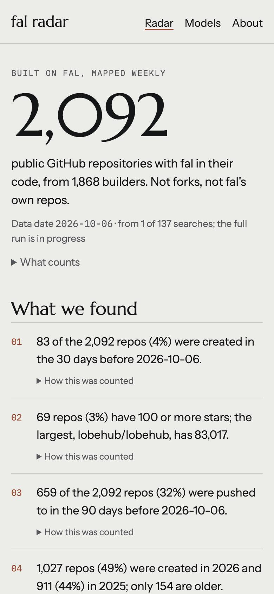

# fal radar

Built on fal, mapped weekly. An unofficial community project.

fal radar finds public GitHub projects built on [fal](https://fal.ai), the generative media platform: repositories whose code uses a fal client, an integration package, fal's HTTP API or a fal model ID. It classifies them, shows which fal models builders use, lists the builders behind them, and drafts a weekly digest.

**Unofficial. Not affiliated with fal.**



## What we found

<!-- findings:start -->
Data date 2026-10-06.

1. 83 of the 2,092 repos (4%) were created in the 30 days before 2026-10-06.
2. 69 repos (3%) have 100 or more stars; the largest, lobehub/lobehub, has 83,017.
3. 659 of the 2,092 repos (32%) were pushed to in the 90 days before 2026-10-06.
4. 1,027 repos (49%) were created in 2026 and 911 (44%) in 2025; only 154 are older.
5. 1,900 repos (91%) belong to individual developers and 192 (9%) to organisations.
<!-- findings:end -->

## How it works

1. A Python collector searches GitHub's REST API (code search and repository search) with a read-only token: fal clients in manifests, imports, calls to `fal.run` and `queue.fal.run`, integration packages, and 108 fal model families read from fal's public catalogue.
2. Searches past GitHub's 1,000-result cap are split by file size or creation date; every hit is checked against the exact string, and hits in documentation count only as mentions.
3. Each repository and owner is looked up once; one manifest per repo gives its kind and stack, and scoped searches list the models of the most starred repos.
4. Only code evidence counts: no forks, no copies of fal's templates, no repos owned by fal.
5. The run writes JSON under `data/`, with a log of every search and its coverage; `collector site-data` and `collector digest` turn that into findings, builders and the weekly digest.
6. A static Next.js site renders those files and nothing else.

## Run it

```bash
uv sync
echo "GH_SEARCH_TOKEN=<a fine-grained token, public repositories, read-only>" > .env
uv run collector run            # 4 to 5 hours the first time; resumable with --resume
uv run collector site-data && uv run collector digest
cd site && npm install && npm run build   # static site in site/out
```

## Caveats

- Counts are lower bounds: private repositories, closed-source products and projects that live only on Discord or X are invisible.
- GitHub's code search reads only the default branch, files under 384 KB and repositories active in the last year, and finds at most 4,000 repositories per search.
- Models per repo are those seen in code the searches read, at least.
- The radar stores only what GitHub shows publicly. To remove a project or profile, open a [removal request](https://github.com/ardanoyan/fal-radar/issues/new?template=remove-my-project.yml).

## Licence

MIT. See [LICENSE](LICENSE). Built by Arda Noyan Karasoglu.
